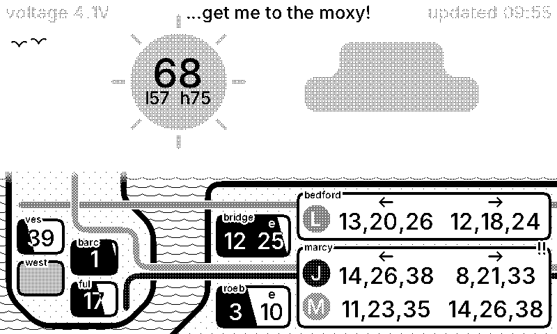

# Status board

An e-ink status board showing things I care about when I leave my apartment.

## How it works

On each render request, the server fetches data from external feeds and generates an image. The server implements the [TRMNL API](https://docs.trmnl.com) to communciate with the display.
